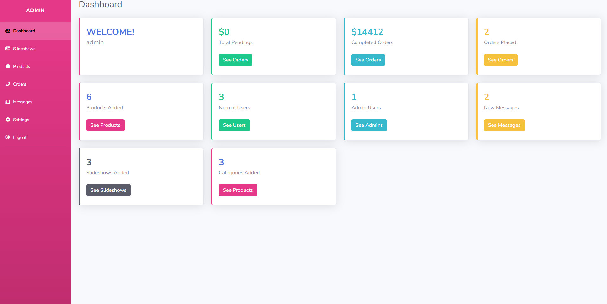

# Ecom-php-admin

This is a PHP-based e-commerce project with an admin dashboard for managing products, users, orders, and more.

## Features

- User registration and login
- Product catalog and search
- Shopping cart and wishlist
- Order checkout with PayPal integration
- Admin dashboard for managing products, categories, users, orders, and messages

## Screenshots

## Installation

1. **Install XAMPP or WAMP**  
   Download and install [XAMPP](https://www.apachefriends.org/) or [WAMP](http://www.wampserver.com/) server.

2. **Clone or Download the Project**  
   Place the project folder (`Nitastore`) in your web server directory (e.g., `htdocs` for XAMPP).

3. **Database Setup**  
   - Open phpMyAdmin.
   - Create a new database (e.g., `ecomp1`).
   - Import the `Ecomp1.sql` file from the project root into your database.

4. **Configure Database Connection**  
   - Edit the database credentials in [`components/connect.php`](components/connect.php) if needed.

5. **Start the Server**  
   - Start Apache and MySQL from your XAMPP/WAMP control panel.
   - Visit `http://localhost/Nitastore` in your browser.

## Admin Access

- **Admin Dashboard:**  
  Visit `http://localhost/Nitastore/admin/admin_login.php`
- **Default Admin Credentials:**  
  - Username: (see your database or register a new admin)
  - Password: `111` (as per the sample data)

## Project Structure

- `admin/` — Admin dashboard and management pages
- `components/` — Reusable PHP components
- `css/`, `js/`, `images/` — Static assets
- `uploaded_img/`, `uploads/` — User and product uploads
- `vendor/` — Third-party libraries (e.g., PayPal SDK)

## Dependencies

- PHP 5.3 or above
- MySQL
- [PayPal REST API SDK for PHP](vendor/paypal/rest-api-sdk-php/README.md)
- Bootstrap, FontAwesome (bundled in `admin/vendor/`)

## License

This project is for educational purposes.

---

Feel free to customize this README as needed for your
